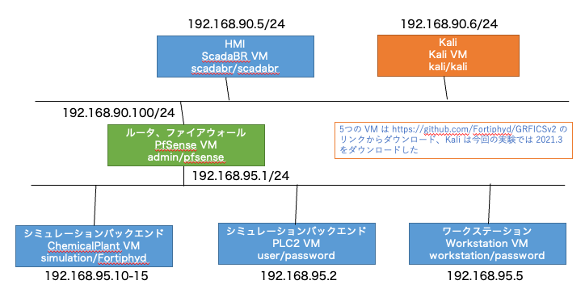
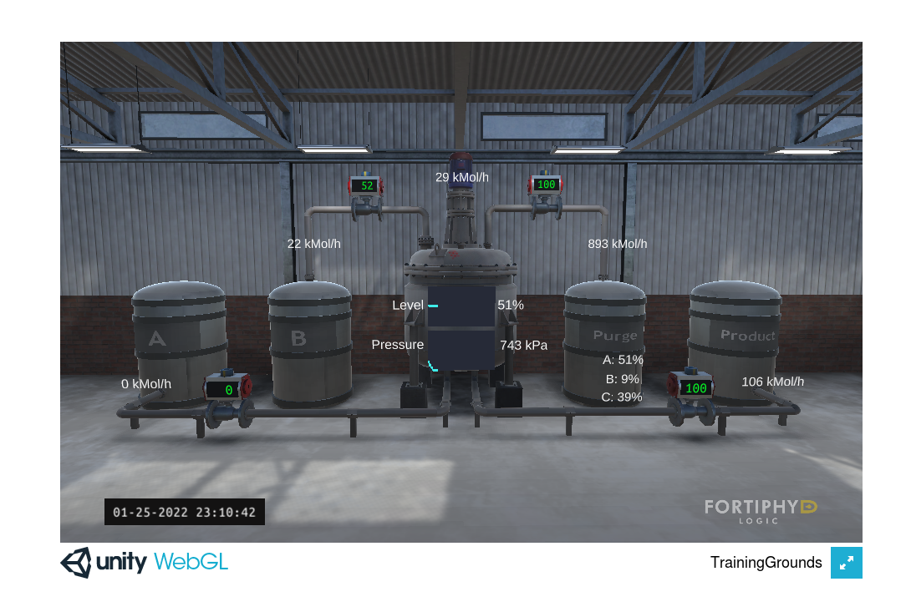
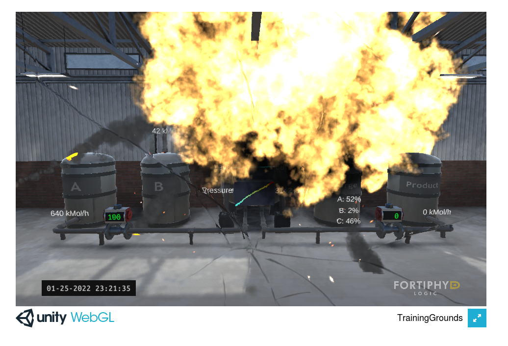
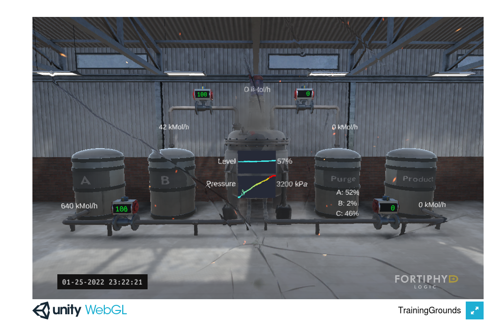

# GRFICSv2 を用いた OT セキュリティ演習

豊田工業高等専門学校 平野研究室
安藤・市古・可知井・河合・副田・桝井

---

# TL;DL

- この演習では OT セキュリティについて扱った

- OT（Operational Technology）= 制御技術・運用技術

- 具体的には仮想マシンで産業制御シミュレーションを構築し、いくつかの攻撃を行った

- SDGs 的な観点では「9. 産業と技術革新の基盤を作ろう」に関連する

---

# 開発の背景、課題

## 一言で

「 OT セキュリティの問題を解決したかった」

## OT セキュリティとは？

OT（Operational Technology）= 制御技術・運用技術
IT（Information Technology）に対して製造業などで用いられるハードウェア上での
セキュリティのこと。

ref. https://www.digital-transformation-real.com/blog/what-is-ot-security

---

# 実現方法

- GRFICSv2 を用いて産業制御シミュレーションを VM 上に構築

- VM 上で動くシミュレーションに対していくつかのサイバー攻撃を行う

- サイバー攻撃には Kali Linux を利用する

GRFICSv2, Kali Linux については次のページで説明します。

---

# GRIFICSv2

https://github.com/Fortiphyd/GRFICSv2 より

> Version 2 of the Graphical Realism Framework for Industrial Control Simulation (GRFICS)

Unity で動く産業制御システムのシミュレーション。

---

# 動作イメージ

今回の演習ではサイバー攻撃によってこの画面が爆発したりします。

---

# Kali Linux

https://www.kali.org/

情報セキュリティテスト用の Linux ディストリビューション。
脆弱性検査やサイバー攻撃に使える。

今回の演習では実際に Kali を用いていくつかのサイバー攻撃を行う。

---

# システム構成

今回のシミュレーションは全て Visrtual Box で起動した仮想マシン上で行う。
サーバ構成は下記の通り。

## 

---

# 実際の動作

実際に稼働中のシミュレーションに対し、悪意のある PLC プログラムを
アップロードしシステムを爆発させた。

ref. https://www.youtube.com/watch?v=TeNy92ZFNQY

---

# 実際の動作 - 正常時

---

# 実際の動作 - 攻撃

---

# 実際の動作 - 攻撃後

---

# 他の技術との相違点

相違点はいくつか存在するが、大きな括りとして IT と OT の違いが存在する。

## IT(Information Technology)

情報技術。わたしたちが普段授業などで学ぶのは大体 IT に関する知識。

## OT(Operational Technology)

製造業などにおいて物理的なシステムを動かすための技術。
今回の演習は OT セキュリティの問題を扱った。
水道や電気など社会インフラに障害が起きると影響範囲が広いのが特徴。

---

# SDGs との関連

## 「9. 産業と技術革新の基盤をつくろう」

社会インフラにセキュリティ的な不安があれば、新たな技術革新は起こせない。

---

# まとめ

- この演習では OT セキュリティについて扱った

- OT（Operational Technology）= 制御技術・運用技術

- 具体的には仮想マシンで産業制御シミュレーションを構築し、いくつかの攻撃を行った

- SDGs 的な観点では「9. 産業と技術革新の基盤を作ろう」に関連する

---

# 参照

- https://www.digital-transformation-real.com/blog/what-is-ot-security
- https://github.com/Fortiphyd/GRFICSv2
- https://en.wikipedia.org/wiki/Kali_Linux
